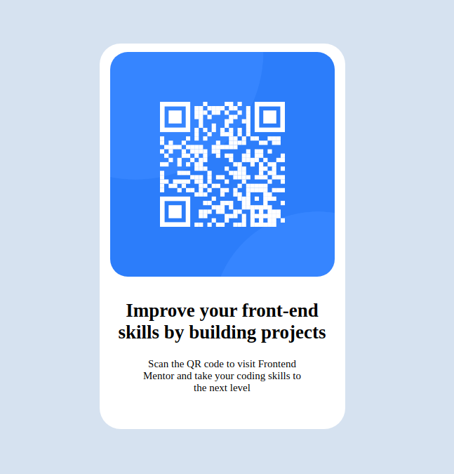

# Frontend Mentor - QR code component solution

This is a solution to the [QR code component challenge on Frontend Mentor](https://www.frontendmentor.io/challenges/qr-code-component-iux_sIO_H). Frontend Mentor challenges help you improve your coding skills by building realistic projects. 

## Table of contents

- [Overview](#overview)
  - [Screenshot](#screenshot)
  - [Links](#links)
- [My process](#my-process)
  - [Built with](#built-with)
  - [What I learned](#what-i-learned)
  - [Continued development](#continued-development)
  - [Useful resources](#useful-resources)
- [Author](#author)
-

## Overview

This is a qr-code component building project, which is my first project on front end mentor. I have completed this project with using few HTML tags only. I have used img, h1 and p tags in the HTML.

### Screenshot

### Links

- Solution URL: [https://github.com/rawatdinesh10/qr-code-component]
- Live Site URL: [https://rawatdinesh10.github.io/qr-code-component/]

## My process

### Built with

- Semantic HTML5 markup
-I have used h1, p, and div elements to structure the page. I have used flexbox to display elements in flex.

### What I learned

I have learned the basics of HTML tags such as h1, p, and img tags. I have also learned about CSS flexbox to layout the elements on page. 

### Continued development

I am comfortable with basic HTML but i need to improve on CSS. I need to learn the intermediate and advcance CSS in order to improve myself. i need to focus on layout and responsive web design and practice it.

### Useful resources

]web.dev] it is a good website to learn HTML & CSS  - This helped me learn the basics of HTML & CSS. I really liked this website and will use it going forward.
- [A complete guide to submitting solutions on Frontend Mentor om Medium](https://medium.com/frontend-mentor/a-complete-guide-to-submitting-solutions-on-frontend-mentor-ac6384162248) - This is an amazing article which helped me finally understand how to submit a solution on frontend mentor platform. I'd recommend it to anyone still learning this concept.

## Author

- Website - ["www.linkedin.com/in/dinesh-rawat-b89085257"]
- Frontend Mentor - [@rawatdinesh10](https://www.frontendmentor.io/profile/rawatdinesh10)
- Twitter - [@dineshrawat325](https://x.com/dineshrawat325)

